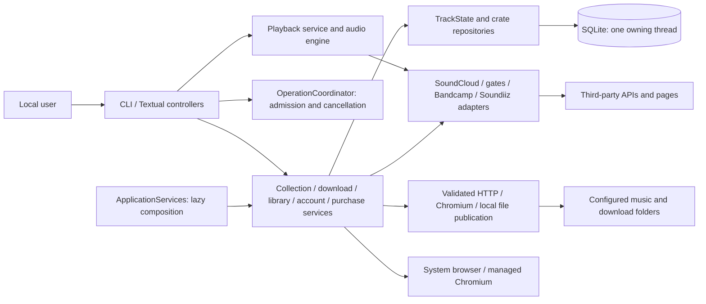

# PROJECT SPECIFICATION — dj-digger

- Status: current implemented system
- Document version: 1.1
- Product version verified: 1.1.0 (working tree)
- Owner: Filip Białogrecki
- Updated: 2026-09-05
- Document lines: <!-- SPEC TOTAL LINES -->1289<!-- END SPEC TOTAL LINES -->
- Section map covers through line: <!-- SPEC MAP LIMIT -->1289<!-- END SPEC MAP LIMIT -->
- Verified against: `pyproject.toml`, `dj_digger/`, `tests/`, `.github/workflows/`, `README.md`, and `CHANGELOG.md`

## Purpose of this file

This file is the durable source of truth for the product and system that are
implemented in the current repository. It records shipped behavior, component
boundaries, interfaces, persistence, security, privacy, integrations, and
verification. It does not contain a roadmap, target design, implementation plan,
or proposed feature. Agents use it to load only the context required by a task.

When this file disagrees with executable code, configuration, or tests, those
artifacts are evidence of the current state and this file must be corrected in
the same change. A behavior that cannot be confirmed in the repository is not an
implemented behavior.

## How to read this file

Never read this document end to end unless the task explicitly requires an
exhaustive audit. Instead:

1. Print only the metadata and generated map:

   ```bash
   python3 scripts/spec_section_map.py --print-map
   ```

2. Select only the sections relevant to the task.
3. Read only the mapped line ranges.
4. For a known endpoint, field, class, environment variable, function, table, or
   collection, use `rg` instead of scanning prose.

The following table is generated from numbered Markdown headings. Explicit
`spec-map-block` markers may expose selected blocks inside an unusually large
subsection; ordinary emphasized text is never promoted into the map.

<!-- BEGIN GENERATED SECTION MAP -->
| § | Section | Lines |
| --- | --- | --- |
| 1 | Specification governance | 113–141 |
| 1.1 | ↳ Authority and scope | 115–127 |
| 1.2 | ↳ Update contract | 128–141 |
| 2 | Product purpose and execution modes | 142–176 |
| 2.1 | ↳ Problem and product boundary | 144–157 |
| 2.2 | ↳ Execution modes | 158–176 |
| 3 | User-visible capabilities | 177–513 |
| 3.1 | ↳ Track collection and saved HTML | 179–198 |
| 3.2 | ↳ Link classification and exports | 199–217 |
| 3.3 | ↳ TUI playlist library and interaction | 218–288 |
| 3.4 | ↳ Audio preview | 289–339 |
| 3.5 | ↳ Downloads and local-file matching | 340–369 |
| 3.6 | ↳ Store purchase assistance | 370–449 |
| 3.7 | ↳ Local library, analysis and audio export | 450–513 |
| 4 | System context and data flow | 514–554 |
| 4.1 | ↳ Context diagram | 516–538 |
| 4.2 | ↳ Collection-to-library flow | 539–554 |
| 5 | Repository layout and component ownership | 555–620 |
| 5.1 | ↳ Entry, orchestration, and models | 557–568 |
| 5.2 | ↳ Network and external-system adapters | 569–587 |
| 5.3 | ↳ Persistence, local media, and UI | 588–620 |
| 6 | Runtime architecture and environments | 621–722 |
| 6.1 | ↳ Runtime and dependencies | 623–638 |
| 6.2 | ↳ Concurrency and lifecycle | 639–707 |
| 6.3 | ↳ Local paths and environment variables | 708–722 |
| 7 | Data model and persistence | 723–810 |
| 7.1 | ↳ Domain objects and identity | 725–739 |
| 7.2 | ↳ SQLite schema and invariants | 740–777 |
| 7.3 | ↳ Crate persistence and deletion | 778–793 |
| 7.4 | ↳ Configuration and credential stores | 794–810 |
| 8 | Public interfaces and contracts | 811–856 |
| 8.1 | ↳ CLI arguments and exit behavior | 813–832 |
| 8.2 | ↳ JSON and CSV summary input | 833–847 |
| 8.3 | ↳ URL-opening contract | 848–856 |
| 9 | Authentication and authorization | 857–900 |
| 9.1 | ↳ SoundCloud authentication | 859–879 |
| 9.2 | ↳ Gate action consent | 880–900 |
| 10 | External integrations | 901–1036 |
| 10.1 | ↳ SoundCloud API and media | 903–914 |
| 10.2 | ↳ Link hubs and download gates | 915–977 |
| 10.2 · block | ↳ ↳ Hypeddit | 923–963 |
| 10.2 · block | ↳ ↳ Other resolvers | 965–970 |
| 10.2 · block | ↳ ↳ Network-write boundary | 972–977 |
| 10.3 | ↳ Browsers and clipboard | 978–989 |
| 10.4 | ↳ Bandcamp cart and Beatport playlists | 990–1036 |
| 11 | Security requirements and threat model | 1037–1091 |
| 11.1 | ↳ Untrusted URLs and SSRF boundary | 1039–1057 |
| 11.2 | ↳ Secret and personal-data handling | 1058–1073 |
| 11.3 | ↳ File and mutation safety | 1074–1091 |
| 12 | Privacy, lifecycle, and retention | 1092–1130 |
| 12.1 | ↳ Data stored locally | 1094–1109 |
| 12.2 | ↳ Data sent to third parties | 1110–1121 |
| 12.3 | ↳ User-controlled deletion | 1122–1130 |
| 13 | Failure behavior and current limitations | 1131–1191 |
| 13.1 | ↳ Error isolation and reporting | 1133–1152 |
| 13.2 | ↳ Confirmed limitations | 1153–1191 |
| 14 | Verification, CI, and release | 1192–1260 |
| 14.1 | ↳ Offline and live test suites | 1194–1225 |
| 14.2 | ↳ Continuous integration and publishing | 1226–1245 |
| 14.3 | ↳ Specification-map verification | 1246–1260 |
| 15 | Evidence and operational references | 1261–1289 |
| 15.1 | ↳ Primary implementation evidence | 1263–1279 |
| 15.2 | ↳ User and historical documentation | 1280–1289 |
<!-- END GENERATED SECTION MAP -->

## 1. Specification governance

### 1.1 Authority and scope

This specification describes the Python package built from `dj_digger/` and the
repository mechanisms that test and publish it. The current product is a local,
terminal-native application. It has no repository-owned server process, public
HTTP service, inbound webhook, message broker, or remotely managed user account
database.

Normative evidence, in descending order, is executable code, test assertions,
packaging and workflow configuration, then current user documentation. Dated
design and implementation documents under `docs/superpowers/` are historical
context and are not evidence that a behavior is present.

### 1.2 Update contract

Any change to product behavior, component ownership, command-line or export
contracts, persistence, external writes, authentication, security, or privacy
must update the affected numbered sections in this file. After editing it, run:

```bash
python3 scripts/spec_section_map.py
python3 scripts/spec_section_map.py --check
```

The generator owns only the generated map and explicitly marked line-count
values. Hand-written content outside those regions is preserved.

## 2. Product purpose and execution modes

### 2.1 Problem and product boundary

`dj-digger` collects tracks behind SoundCloud playlist, user,
collection, and track links, extracts purchase and download destinations, and
presents them as a local playlist. It avoids relying on the finite set of tracks
rendered in a SoundCloud page by using SoundCloud API v2, while retaining a
saved-HTML path for private, unlisted, or otherwise inaccessible pages.

The application helps the user inspect, open, download, classify, audition, and
remember tracks. Local music can be browsed, analyzed, collected into local
playlists and exported to a folder using documented deck audio profiles. It does
not format USB drives or generate rekordbox libraries. It does not purchase products or complete checkout. Gate and
store behavior is limited to the provider flows described in §§10.2 and 10.4.

### 2.2 Execution modes

The installed entry point is `dj-digger = dj_digger.cli:main`. The following
modes are implemented:

- `dj-digger [target]` assumes the `dig` command. With a terminal it may enter
  the Textual TUI; without a terminal or with `--no-tui`, it reports and exports
  non-interactively.
- `dj-digger dig [target]` accepts a SoundCloud HTTP(S) URL or an existing local
  saved-HTML file. A missing target is valid only when the TUI can ask for one.
- `dj-digger open SUMMARY` reads an exported JSON summary, displays it, and
  either opens selected links or imports the partial data into the TUI.
- `dj-digger auth ...` manages SoundCloud credentials.
- `python -m dj_digger` delegates to the same CLI entry point.

The TUI is a local process. Network, disk scan, download, playback preparation,
cart, and batch browser work are process-local background workers rather than a
durable job queue.

## 3. User-visible capabilities

### 3.1 Track collection and saved HTML

For SoundCloud URLs, `SoundCloudClient.collect()` resolves the URL and handles:

- users and `/likes`, `/tracks`, or `/reposts` through paginated user endpoints;
- single tracks as one-track playlists;
- playlists/sets by collecting track IDs and hydrating them in batches of 50;
- an optional limit applied to collected tracks.

Hydration restores playlist order because the `/tracks` response is not assumed
to preserve it. Deleted or unavailable tracks omitted by SoundCloud remain
absent. Public API failures are surfaced as `SoundCloudError`; private or
unlisted sources are directed to the saved-HTML fallback.

For a local HTML file, `html_fallback.load_playlist()` reads
`window.__sc_hydration`, track anchors, and a declared count. IDs are batch
hydrated through API v2. If no IDs exist but track URLs do, pages are fetched
sequentially with the configured delay and anchor text is inspected for purchase
or download keywords. UTF-8 is tried first and Latin-1 is the decoding fallback.

### 3.2 Link classification and exports

Each track is converted to one or more `LinkRecord` values. Candidate priority is
the structured `purchase_url`, then `extra_links`, then URLs in the description.
At most one link per recognized category is retained. Description links are
restricted to purchase/download categories to avoid collecting general promo
and streaming boilerplate.

The canonical category order is `soundcloud`, `no-link`, `bandcamp`, `beatport`,
`traxsource`, `junodownload`, `apple`, `shop`, `gate`, `smartlink`, `streaming`,
and `others`. Matching uses URL scheme validation and domain boundaries. A free
SoundCloud download is retained even when a store link exists. A track with no
usable link receives a `no-link` record pointing to its SoundCloud page.

Exports are `json`, `csv`, or `none`. JSON groups the compatibility object shape
by category. CSV columns are `category`, `artist`, `title`, `track_url`, and
`shop_link`. The default path is `soundcloud_links.<format>`. Current code reads
JSON summaries; YAML input is rejected with an explicit legacy-format error.

### 3.3 TUI playlist library and interaction

`DiggerApp` presents a playlist sidebar, track table, error banner, status bar,
search input, footer, and collapsible player bar. The sidebar lists saved
playlists and loads a playlist's tracks when it is selected. Settings can add BPM, key, year, and label columns between Genre and Time and
choose the Textual theme. Every colour the interface paints is a role of the
active theme (`tui/theme.py`): primary for store badges, the active filter,
selection marks and help keys; success for got and free downloads; secondary
for opened and newly arrived tracks; accent for the playing marker and the
played waveform; warning for a download in progress and the error banner
summary; a blend of foreground and background for secondary text. Theme
definitions are supplied by Textual.
Changes to a single
row (a mark, an opened link, the playing marker, download progress) repaint
that row in place; the table is rebuilt only when the visible set changes.
`q` and Ctrl+C both quit; Ctrl+C is bound with priority so it also quits from
the search box. The status bar is built like Textual's footer: a horizontal scrollable
container with its scrollbar hidden, so the store legend always lists every
store and scrolls sideways (mouse wheel or drag) when wider than the terminal.
Its right side, docked so it never scrolls away, shows only the running job
and the view's state (selection, sort, search, hidden rows, partial playlist);
the track counts are gone. One job at a time (dig, download batch, bulk open, scan, cart)
reports in the status bar as a spinner with its name, counts, failures, and
`^X stop`; `ctrl+x` (also bound with priority) cancels it. The table keeps its
rows during a refresh dig instead of blanking. The search box matches every
word, in any order, against artist, title, genre, tags, and label; Escape in the
box returns to the list with the filter kept, and Escape on the list clears the
selection, then the search, then the store filter and hiding. `t` cycles the
sort (title, time, genre, status, store, plus any enabled BPM/key/year column)
with an arrow on the sorted header, `T` reverses it, and sorting is applied
when rows are matched so it survives repaints. Textual's command palette stays disabled. Resetting a playlist's
statuses asks for confirmation, since statuses are global by track and the
reset has no undo. `v`, `V`, and `ctrl+a` build a
selection of track keys; batch download, bulk open, cart, export, marks, and
removal act on the selection when there is one, else on every row shown. Handing a link or a store search to the browser runs in a thread worker,
because the WSL bridge can block for seconds; the status mark is written back
on the UI thread. `tui/keymap.py` is the single
source for bindings, footer labels, and help text. Implemented operations include
playlist import/refresh/delete, local-only track removal and undo, store/search and
handled-state filters, row status changes, opening one or many links, export,
download, cart preflight, local-file path copy, playback, seeking, volume, and
settings. The visible footer groups `o` with `shift+o`, `b` with `shift+b`, and
`c` with `shift+c`; shifted letters are displayed in lowercase. The store-search
labels say `Search in Bandcamp` and `Search in Beatport`. The footer
shows `g`, `k`, and `u` for got, skipped, and unmarked, and opens Settings with
`s`. Download uses `d`, `shift+d` downloads all eligible visible tracks, and
`a` adds a playlist. Its initial fit is calculated from the application width, so focusing or
clicking a widget does not reveal bindings that should have fitted at startup.

In the track table, a local-file match is shown as the monochrome one-cell `▣`
at the start of the first marker column; `▶` follows it while the track plays.
No folder emoji is appended to the track title. `o` opens the selected row;
`shift+o` applies the same action to every currently visible row.

Statuses are `new`, `opened`, `skip`, and `got`. Opening a link promotes `new` to
`opened`. User marks are global by stable track key, so they appear across playlists.
Playlist refresh preserves locally removed track keys, marks newly arrived keys,
and sorts those arrivals above older active tracks while retaining source order
within each group.

The latest saved playlist opens when the TUI starts without incoming rows. On first
run, settings are shown before the initial library scan. Terminals below 110
columns automatically collapse the sidebar; the full help remains available.
Opening more than 20 visible links requires a repeated confirmation action.

The error banner occupies the full-width first line above every other TUI
element and opens collapsed to a single summary line carrying the error count.
Clicking that line expands the scrollable message list and clicking it again
collapses it; the close control discards every message and returns the banner to
its collapsed state.

### 3.4 Audio preview

Local playback uses FFmpeg to produce 44.1 kHz stereo signed-16 PCM in a bounded
two-second ready buffer. A single decoder-control thread handles repeated seeks;
old generations cannot fill the new buffer. The audio callback only consumes
ready samples: underrun produces silence without advancing the media position,
while EOF and decoder failures remain distinct. Playback sources hold leases
until their decoder has actually stopped; prefetched files are also protected
from replacement. Local waveforms are generated independently after playback is
ready and cached in at most 128 files, each containing at most 1024 peaks.
The rendered waveform updates when these peaks arrive; pause and seek do not
discard them, while switching the loaded audio rejects obsolete results.
This playback PCM is never reused for analysis or export.

Playback is optional and requires the `play` extra containing `miniaudio`.
`resolve_stream()` refetches track metadata, rejects non-streamable tracks and
snippet-only policy, chooses a progressive MP3 transcoding, authorizes its signed
URL, and returns duration and waveform location.

The audio worker resolves the stream, fetches the waveform, and opens the HTTP
source before handing the track to the UI thread, so no connection is opened from
the interface thread.

Audio is decoded from an HTTP source and is not persisted to disk. A declared
source at or below 50 MiB is buffered progressively in memory; larger or
undeclared sources stream directly. Range requests support seeking. Waveforms
are cached in memory for the process, rendered as four block rows filling the
player bar, and accompanied by an output-sample level meter.

A three-row control strip sits under the waveform whenever a track is loaded:
previous track, play/pause, next track, the track title, elapsed and total time,
a click-and-drag volume slider, and a close control. Play/pause here acts on the
loaded track rather than on the cursor row. A player message replaces the title
while it stands; with no track loaded the bar shows the message alone.
Closing stops playback, clears the loaded track and any player message, discards
prepared audio, and folds the player away; `ctrl+w` does the same.

The next visible track is prepared during the last 20 seconds of playback. A
filter change discards preparation that no longer matches the next row. Tracks
advance automatically at end of stream. Playback follows the selected playlist
occurrence, so repeated track IDs advance past their own row instead of looping
back to the first occurrence. Missing `miniaudio`, an unavailable
audio device, a backend that refuses to start or stop an open device, bad media,
or a missing track ID produces a user-visible degraded state rather than
terminating the TUI. A device that fails after having worked is closed and
rebuilt on the next attempt rather than disabling playback for the session.
Decoder EOF and failures become generation-tagged playback events inside the
audio callback, so neither escapes through CFFI. Events from a generator made
stale by stop, seek, unload, or a new load are ignored. At the end of the visible
list the final track stays loaded; pressing play again starts it from the beginning.

### 3.5 Downloads and local-file matching

The selected track or all eligible visible tracks can be downloaded to the
configured directory. Resolution priority is a selected gate, an explicit
artist download URL, then the authenticated SoundCloud download endpoint.
Finished files are atomically renamed from a `.part` file to a sanitized,
collision-free filename. Recognized suffixes are MP3, WAV, FLAC, AIFF/AIF, and
ZIP. HTML responses are rejected as files, redirect hops are bounded at five,
and the maximum body size is 2 GiB.

Batch downloads use at most eight worker threads. Each gate flow uses its own HTTP
session because cookies are flow state. Prerequisites such as a real profile,
SoundCloud login, or manual Hypeddit browser completion are collected and retried
at most once by the TUI flow. Completed downloads store their local path and mark
the track `got`.

The local scanner recursively indexes configured directories for MP3, WAV, FLAC,
AIFF, M4A, AAC, OGG, and ALAC files, following symbolic links, and caches path,
modification time, size, and normalized filename data in SQLite in batches of
200 rows per transaction. Folders it cannot enter are collected as errors
rather than skipped silently and reported in the error banner after the scan, and a cancel event stops the walk between files
while keeping what was already written. Artist-plus-title matches are confident and
may set `got`; title-only matches require at least six normalized characters and
only attach a path. A unique filename may contain extra text around the matched
artist/title, such as a mix label; ambiguous decorated matches are rejected.
Missing files are removed only after a complete readable parent listing on the
known volume; inaccessible or replaced roots retain their records. Directory
inode/device tracking prevents symlink cycles. Only file-provenance `got` marks
are eligible for clearing.

### 3.6 Store purchase assistance

Store assistance is explicitly initiated by the user. Bandcamp uses verified
cart automation; Beatport produces a playlist for a supported transfer instead
of attempting to log in or mutate a cart. The TUI owns one lazy persistent
Chromium profile for its lifetime and drives it headless, out of sight, for
product discovery, revalidation, and mutation with at most two managed work
pages. A window appears only when there is something for the user: the
completed cart view and the manual-finish step open a separate visible browser
carrying the hidden session's cookies, so the profile is never switched
between modes; a desktop display is needed for those two steps only. The
Settings login opens the profile itself headed for the login and returns it to
hidden use afterwards, retrying a still-locked profile a few times.
Bandcamp cart continuity depends on the persistent cookie jar and does not
require an account login. Settings can open or inspect the Bandcamp session and
explicitly reset the dedicated store profile.
`P` opens every exact Beatport track page among the targeted rows in the
configured regular browser (release links are counted and skipped), with the
same confirmation threshold as bulk open, because Beatport carts are not
automated. With no store filter, Bandcamp is preferred and Beatport is the
business-level fallback. When both filters are explicitly active, the TUI emits independent
requests so a successful Bandcamp addition does not remove that track from the
Beatport playlist.

Two asynchronous page workers preflight a batch. They resolve an exact product,
check individual availability and price, verify current cart membership, and
return an editable plan. A single fixed-price track may proceed directly from
the explicit `c` action; batches and flexible Bandcamp prices require the plan
screen. The user may deselect items and press `E` to raise a Bandcamp price from
its verified minimum in store-declared steps only when the store exposes an
editable price. The review table shrinks to preserve its action buttons in short
terminals and accepts `Y`, `Enter`, or a button click to continue. A canonical
Beatport `/track/<slug>/<numeric-id>` link becomes an exact playlist entry
without starting Playwright. Release links use read-only lookup, retain an exact
track URL when one is available, and fall back to artist/title metadata when a
changed page or security challenge prevents exact discovery.

Before each mutation the page is reloaded and product identity and price are
compared with the preflight snapshot. Ambiguous matches, version mismatch,
changed price or product identity, unavailable controls, external redirects, or
failed cart verification skip or fail the affected item. An add is not retried
when its verification is uncertain. Bandcamp verification runs three stages on
their own clocks (the cart count for 5 s, the real side-cart control requiring a
visible removable row with the same canonical host and path for 10 s, one
reload check for 25 s) inside a 45-second budget, and an unverified result names
the stage it gave up at. An unverified click or a structural failure saves a
screenshot and a redacted page copy (script bodies and query strings removed)
under `cart-diagnostics` in the data directory, keeping the last ten. After two
unverified clicks in one store the batch stops clicking: the remaining products
are opened with Buy expanded and the price filled, the TUI asks the user to
press Add to cart themselves, and one read-only cart check per item records
`manual` or a manual failure. The result screen offers the same for items a
batch left uncertain. A user-raised price is filled into Bandcamp's current price input
or fails before the add click; it is never silently discarded. A still-uncertain
page remains open for manual inspection. The flow leaves verified carts open for
the user while releasing the batch worker for another request; a failure to
show the final cart window is reported as a warning and never discards the
verified additions. Mutation is serial within each store,
cancellation after a click waits for one bounded verification, and repeated
structural failures open a per-store circuit breaker without
navigating the rest of the queue. Results group identical root causes and mark
only failures that are safe to retry. Approved Beatport items and safe Beatport
lookup fallbacks are reported as playlist-ready, not as cart failures. The
result action writes a new, non-overwriting plain-text playlist in the playlist's
download folder and copies its entries to the clipboard. It also sends the
accepted titles and artists, with Beatport preset as the destination, to
Soundiiz's public playlist-import endpoint and opens the returned HTTPS review
URL in the configured regular browser. The response URL must remain on
`soundiiz.com/go/import-playlist/`; imports are limited to Soundiiz's documented
1–200 tracks. Promo prefixes, uploader names, preview markers, trailing label
fields, and `OUT NOW` markers are removed from SoundCloud metadata when its title
contains an explicit `artist - title` pair, including missing whitespace around
the separator. Featured performers and remixers named in the cleaned metadata
are also sent as Soundiiz artists to improve catalog matching. Exact Beatport
URLs are written to the local file when
known and replace that track's stored Beatport release link in the current
playlist; release and label URLs are never persisted as exact matches. Other
rows use the cleaned `artist - title`. Match review, transfer approval, payment,
and checkout remain manual.

### 3.7 Local library, analysis and audio export

The sidebar has playlists above a lazy directory explorer, initially 50/50.
Both section headings are centered and use the same muted text color.
Saved splits are 30/70, 50/50 and 70/30; `ctrl+r` switches visible sections,
including on short terminals. Pins, configured directories, downloads and mounted
volumes form the roots. `ctrl+f` opens any explicit directory; `ctrl+n` cycles
250-file pages. The explorer uses one-cell scrollbars and a one-line
“+ Open folder” button matching “+ Add playlist”. Shortcut hints and file counters
are omitted; a compact “Next page” button appears only for multi-page folders.
Names load before metadata; no audio analysis or content hashing
runs just because a directory is opened. At most 1000 immediate subdirectories
are shown per expanded tree node; additional paths can be entered directly.
Local rows do not require a `LinkRecord`. `ctrl+l` creates/appends a local playlist.

`j` runs optional librosa analysis in one spawned process, using continuous
FFmpeg resampling and overlapping STFT frames (`center=False` semantics), one
global onset envelope and aggregated chroma. Channel powers are combined before
feature aggregation to avoid anti-phase cancellation. Feature envelopes use a
temporary disk file rather than keeping decoded audio in RAM. Automatic results
are estimates; no confidence percentage is claimed. `ctrl+k` edits BPM/key and
supports tempo ×2/÷2 plus classical/Camelot choices. Manual values, current
analysis, and source tags are stored separately with that priority. Cache checks
include file signature, SHA-256, algorithm version and parameters. Audio tags and
rekordbox data are never written by analysis.

`ctrl+e` first constructs a frozen export plan, then shows a review. Defaults are
WAV, at most 24 bit/48 kHz, copying every selected audio file to a unique new
folder, including unchanged files. An unselected folder view covers all matching
pages; recursion is explicit. WAV/AIFF targets retain compatible WAV/AIFF/MP3/AAC;
FLAC additionally retains compatible FLAC/ALAC. Only necessary conversions run.
No automatic upsampling, downmix or normalization is performed. Nonstandard
sample rates, ambiguous streams, clipping and unsupported parameters are reported
as exceptions. Known text metadata is preserved where the output muxer supports
it; supported FLAC artwork is copied, other omitted metadata is reported.

Versioned rules cover CDJ-350, 850/850-K, 2000, 2000NXS, 2000NXS2, 3000 and 3000X.
Both profile compatibility and actual-set compatibility distinguish documented
compatible, incompatible and unverified files. These are audio rules, not proof
of device testing or of USB filesystem support. WAV output is canonical RIFF PCM
with checked chunk sizes, alignment and sample identity for lossless transforms.
New files undergo full decoding and length/parameter verification; copies also
undergo byte hashing. Classic RIFF and FAT32 file-size limits are enforced.

Replacement is never a remembered default. A durable per-file journal records
preparation, temporary-original preservation, installation, database commit and
cleanup. Installation uses platform-exclusive rename rather than overwriting
foreign files. Symbolic/hard links and playback leases prevent replacement.
Cancellation is cooperative during preparation and between files; commit settles
without interruption. Startup recovery compares content hashes, completes or
restores unambiguous states and preserves ambiguous ones. Successful replacement
leaves no lasting backup. Directory fsync is used where supported; this is not a
cross-filesystem transaction or guarantee against storage power loss. New-folder
exports keep partial results and a complete report; `ctrl+u` resumes the most
recent unfinished operation from the application's trusted SQLite journal.

`i` imports playlists created by a SoundCloud profile independently of
profile-track digging. Private mode checks `/me` ownership and session identity.
Pagination detects repeated cursors; track hydration is batched with a bounded
cache and preserves duplicates/order. Missing tracks or incomplete replies retain
the previous snapshot. Provider playlist IDs preserve identity across permalink
changes; local deletion generations suppress stale results. Mass import performs
no external gate/hub resolution.

## 4. System context and data flow

### 4.1 Context diagram



All durable application state is local. SoundCloud, gate providers,
stores, and link destinations are third-party systems. No application data is
synchronized to a repository-owned backend.

### 4.2 Collection-to-library flow

`cli.handle_dig()` and `DiggingController` obtain the same `CollectionService`
from `ApplicationServices`. Its read/persist flow collects and commits completed
collections before delivering the result to either front end.
The target becomes a `Crate`, link hubs may enrich or replace wrapper links, and
the collection repository persists the current track representation. Active
tracks are categorized only after loading, allowing improved classification code
to affect crates stored by earlier versions.

In the TUI, rows group all records with the same `Track.key`. Rendering and
filters consume rows; rendering reads committed status/provenance mirrors,
without per-row SQLite queries. Services commit completed effects before the
controllers apply keyed updates to the current view. Stream URLs are fetched at
playback time and are not stored in the crate record.

## 5. Repository layout and component ownership

### 5.1 Entry, orchestration, and models

- `dj_digger/cli.py` owns argument parsing, terminal selection, reporting,
  export/open flows, authentication commands, and process exit codes.
- `dj_digger/services/collection.py` owns source selection, saved-HTML orchestration, progress
  stages, and concurrent link-hub expansion.
- `dj_digger/models.py` owns `Track`, `Crate`, and `LinkRecord`, the vocabulary
  shared across collection, classification, persistence, playback, and UI; it
  also defines the pure track-status vocabulary.
- `dj_digger/links.py` owns category/domain policy, record grouping, and the
  JSON/CSV contracts.

### 5.2 Network and external-system adapters

- `soundcloud.py` owns API v2 discovery, authenticated requests, hydration,
  pagination and media authorization. `files.py` owns validated HTTP/browser
  file publication and local copies under one filename lock.
- `html_fallback.py` owns saved SoundCloud page parsing and the slow per-track
  page fallback.
- `gates/hubs.py` inspects link hubs, `gates/providers.py` implements HTTP gate
  protocols and `gates/browser.py` drives Hypeddit completion in Chromium.
  `gate_models.py` owns their typed outcomes and inspection data.
- `http.py` owns URL/redirect validation; `browser.py` owns OS browser handoff
  and WSL bridging. `browser_session.py` owns managed Chromium launch, profile
  paths, display checks and installation.
- `stores/bandcamp.py` owns Bandcamp selectors and page interaction.
  `services/purchases.py` owns batch approval, preflight, mutation and manual
  completion, and Soundiiz handoff. `cart_models.py`, `store_urls.py`,
  `store_match.py` and `store_parse.py` retain store data, URL checks, matching
  and HTML parsing. `beatport_playlist.py` owns Soundiiz metadata and transport.

### 5.3 Persistence, local media, and UI

- `db.py` owns the single-thread SQLite connection and short transactions;
  `schema.py` recognizes and registers the 1.0 schema. `state.py` owns atomic
  status/provenance and committed caches. `crate_models.py` owns pure crate
  values/serialization; `library.py` retains persistence helpers and
  `services/library.py` owns interactive listing/loading/reset/deletion; `scanner.py` owns local media indexing and matching.
- `services/runtime.py` is the lazy application composition root.
  Collection, downloads, library reconciliation, accounts, browser opening and
  purchases are services; none imports Textual. Operation admission and
  settlement live in `services/operations.py`, independently of execution.
  `DownloadWorkflow` owns the common single/batch attempt, eight-thread HTTP
  pool, browser completion and approved prerequisite retry. Its request holds
  source/generation, destination and timeout; keyed events carry the operation
  ID. Terminal outcomes distinguish downloaded, published-but-unrecorded (with
  its path), failed, cancelled, and waiting for user input. Batch summaries count
  cancellation separately. The TUI coalesces byte events and presents outcomes
  after persistence.
- `paths.py` owns XDG directories. `config.py` owns preferences;
  `private_json.py` owns private atomic JSON writes; `clipboard.py` owns clipboard
  subprocesses. `diagnostics.py` redacts credential fields and URL queries.
- `player.py` owns buffering, decoding and device lifecycle. Stream resolution
  and prepared media live in `services/playback.py`, independently of table rows.
  `tui/audio.py` owns waveform, meter and transport rendering. The engine imports
  neither Rich nor Textual.
- `tui/app.py` composes the screen and routes actions, messages and lifecycle to
  concrete controllers. `tui/presentation.py` separates playlist, audio, sidebar,
  download, cart and scan state. Controllers receive concrete services and the
  presentation callbacks they use, rather than the application object.
  `tui/playlist.py` computes filtering, stable sorting and operation targets.
  `tui/render.py` preserves incremental row updates and cursor/viewport position.
  Account and settings dialogs delegate disk/network work to services.

## 6. Runtime architecture and environments

### 6.1 Runtime and dependencies

The package requires Python 3.12 or newer and is built with Hatchling. Runtime
dependencies are `requests`, `beautifulsoup4`, `textual` (pinned to the 8.x
line because the TUI relies on its binding semantics and a few private hooks),
`rich`, and `playwright`. `miniaudio` is optional in the `play` extra. `librosa` is optional in the
`analyze` extra and imports only in analysis workers. FFmpeg/ffprobe are external
executables required only by local media inspection/playback/conversion/analysis. The `dev` extra adds
`pytest`, `miniaudio`, and `ruff`. There is no runtime JavaScript build, database
server, container image, or infrastructure-as-code layer in the repository.

The code has platform branches for Linux, macOS, Windows, and WSL. Browser
availability and clipboard utilities are detected at runtime. Cart and managed
Chromium flows require a desktop display; WSL requires a working graphical
integration.

### 6.2 Concurrency and lifecycle

SQLite exposes one `Database` instance per path and one dedicated owning thread.
The connection is created, used and closed there, with WAL, foreign keys and a
10-second busy timeout. Repository calls use explicit short transactions; nested
calls participate in the same transaction. Synchronous callers use workers;
connection and cursor objects never cross the owner boundary. `TrackState`
serializes compound status/provenance updates and updates its in-memory mirrors
only after commit. Painting rows reads the mirrors, without per-row SQLite reads.
Missing-file observations carry a per-track revision: a stale scan cannot clear
a newer completed download or manual status decision. Certain positive matches
retain the 1.0 rule allowing `got` after `skip`. Status actions run as workers so
keyboard navigation remains available while a write waits. Mark actions retain
their original sequence, including repeated-key undo and cursor advance. A
queued mark captures the playlist view generation before waiting and is dropped
if that view changes. Sidebar loads have a separate request generation so a
slower previous selection cannot replace the latest selected playlist.
Another process writing the same database is not reconciled.

`OperationCoordinator` admits one main operation (dig/refresh, download, local
copy, cart or bulk opening) and one independent scan, with no task queue or
scheduler. Existing Textual workers, thread pools and asynchronous Playwright
execute the work. Each `OperationHandle` identifies progress, cancellation and
settlement; cancellation leaves its slot occupied until workers and suboperations
finish, including profile saves already in progress when cancellation arrives.
Dialog callbacks retain the originating cancellation event. The main operation
owns the status bar; otherwise the scan is shown.
`ctrl+x` cancels the visible operation. Single-link opening, export, playback
and prefetch run independently of the main slot.

Digging, hub expansion, hydration, downloads, and scanning check cancellation
between requests, pages, chunks or files. A cancelled dig is not persisted.
Workers receive copies of track inputs; collection and file services persist
completed effects before delivering view updates. Playlist view generations
reject late metadata/progress, while database generations prevent an old result
from recreating a deleted/recreated playlist. Playback requests and prefetch
have separate counters, including repeated A→B→A requests. Byte progress is
coalesced to the latest value per track/operation; terminal outcomes are delivered
individually. Painting retains the existing throttling and stable cursor.

Hub expansion and download batches use eight threads. Hypeddit HTTP flows allow
two concurrent requests per host; nested gates release the host limit before
recursing. A persistent profile is never driven by concurrent Playwright threads.
SoundCloud API and public transfer sessions are separate, and each gate flow has
its own cookie jar. Retired clients remain open until their active workers settle.

Shutdown first refuses new operations and signals cancellation/dialogs. Worker
scopes count actual thread execution, including account verification. Media
processes are registered; emergency exit kills and reaps only owned media process
groups before exiting, including a spawned analyzer and its FFmpeg child. Asynchronous
I/O waits for its thread to settle on cancellation. Prepared media is discarded;
worker-owned clients/audio resources close after active workers, with SQLite
last. Asynchronous Playwright close retains its five-second local timeout. The
three-second emergency exit guard starts during unmount, covering asyncio thread
draining before `App.run()` returns; lingering non-daemon threads after return
also have a bounded grace. SIGINT after restoring the terminal exits with status 130.
Resources in use by an unfinished thread are not closed underneath it.

Cart automation uses Playwright's asynchronous API on Textual's event loop.
Textual awaits the editable plan inside an async worker, while one context at a
time drives the persistent profile and all Playwright objects remain on their
creating loop. One hidden persistent context serves the batch, and a separate
visible browser (cookies copied from it) shows the final cart or the items to
finish by hand; closing either keeps Playwright running for the next batch.
Two queue consumers bound
read-only preflight concurrency; Bandcamp mutation is serial, while exact
Beatport track links bypass Playwright and other Beatport results become local
playlist entries.

### 6.3 Local paths and environment variables

Defaults follow XDG paths:

- data: `$XDG_DATA_HOME/dj-digger` or `~/.local/share/dj-digger`;
- config: `$XDG_CONFIG_HOME/dj-digger` or `~/.config/dj-digger`;
- cache: `$XDG_CACHE_HOME/dj-digger` or `~/.cache/dj-digger`.

`SOUNDCLOUD_OAUTH_TOKEN` overrides stored SoundCloud credentials.
`TEXTUAL_ANIMATIONS=none` selects the calmer UI tick via Textual animation
level. `WSL_DISTRO_NAME` participates in WSL detection. `DJ_DIGGER_URL` is an
internal environment handoff used to keep a URL out of PowerShell source text.
`WSLVIEW_SKIP_VALIDATION_CHECK` is defaulted to `1` by the browser module.
`DJ_DIGGER_LIVE_URL` is consumed only by the live test workflow/test fixture.

## 7. Data model and persistence

### 7.1 Domain objects and identity

`Track` stores SoundCloud identity and metadata, purchase/download attributes,
description-derived links, an optional local path, and the optional DJ fields
`bpm`, `key_signature`, `release_year` (from the release date, else the upload
date), and `label_name`, each empty when SoundCloud has none. A shared `track_key` helper preserves existing SoundCloud ID/permalink keys.
A registered local file uses `local:<uuid>`, independent of its path or title. A free
download requires both `downloadable` and `has_downloads_left`; a direct download
additionally requires `download_url`.

`Crate` is a source, title, optional declared count, and ordered tracks.
`LinkRecord` is one category, track, URL, and label. Its compatibility JSON shape
contains `title`, `track_url`, `shop_link`, `artist`, `track_id`, and `link_text`,
plus `bpm`, `key`, `release_year`, and `label`, which are read back when present.

### 7.2 SQLite schema and invariants

The default database is `digger.db`. `schema.open_database()` recognizes or creates:

- `track_states(key PRIMARY KEY, status, updated)`;
- `local_files(path PRIMARY KEY, mtime, normalized_stem)` plus an index on
  `normalized_stem`;
- `track_local_files(key PRIMARY KEY, path)`;
- `crates(source PRIMARY KEY, title, updated, record_json)`.

`list_crate_headers()` returns source, title, updated, and the `partial` flag
(through `json_extract`) so the sidebar never deserializes tracks;
`upsert_local_files()` writes scanner rows in one transaction.
`set_track_status()` stamps `updated` itself.

`all_track_statuses()` and `all_track_local_files()` read whole tables for the
`TrackState` mirror. Setting status to `new` deletes the status row. A manual status decision removes
file provenance. `set_local_file()` atomically records `got` and the path;
clearing provenance resets `got` only when that mark depended on the file.

Schema 2 additionally contains `media_files`, `media_analysis`, ordered
`local_playlist_items`, `playlist_aliases`, `media_operations`, and `media_roots`.
Local playlist JSON keeps user edits while memberships refer to centrally stored
file records; `LibraryService.load` hydrates metadata and analysis on demand.
Export copies have separate file IDs and a parent-file reference. Replacement
preserves file identity and manual values. Confirmed same-inode renames on the
same filesystem can relocate the record; similar titles never merge versions.

`PRAGMA user_version=2` is created for new libraries. Existing recognized v0/v1
shapes are checked read-only first, then under `BEGIN IMMEDIATE`. A separate
committed reader performs `Connection.backup()` while the writer is reserved.
Every migration gets an integrity-checked backup including committed WAL data,
with a 30-second backup deadline. Failure aborts migration. No media scan or
decode is part of migration. Unknown/older/newer shapes are left untouched and
raise `UnsupportedSchema`. A CLI instance lock protects the data directory;
users must close older applications before upgrading. Downgrade requires an
explicit backup restore. POSIX private file modes do not promise Windows ACLs.

### 7.3 Crate persistence and deletion

`CrateRecord` version 1 stores source, title, complete `Track` values, removed
keys, newly arrived keys, import/refresh timestamps, and a partial flag inside
`record_json`. Unknown track fields are ignored when reading, while known fields
are reconstructed. Stream URLs are not part of `Track` and are not persisted.

The source string is the crate primary key. Full import saves a complete record;
refresh, track removal and metadata updates read the current record in a short
transaction and change their own fields. Later removed keys and unrelated NEW
metadata survive link updates. Each deletion changes a session generation;
results carrying the previous generation cannot update a recreated crate.
Listing orders the database query by update time but returns records sorted by
case-folded title. Deleting a crate deletes its database row and does not delete
track states, credentials, downloads, or source media.

### 7.4 Configuration and credential stores

`config.json` contains `user_name`, `user_email`, custom gate comments, scan
directories, browser choice, download directory, `gate_social_actions`,
`columns`, the optional track-table columns (`bpm`, `key`, `year`, `label`)
kept in canonical order with unknown names dropped, and `theme`, the Textual
theme name applied at startup and saved whenever it changes. Local preferences
also include `pinned_directories`, `sidebar_split` and `sidebar_mode`.
The default email uses the reserved `.invalid` domain. A first missing config is
created and marks the launch as first-run.

`auth.json` stores a verified SoundCloud OAuth token with username and user ID.
JSON writes use a 0600 temporary file, atomic replacement, and an
attempt to restrict the containing directory to 0700. Managed SoundCloud and
store Chromium profiles are separate directories under the data path and are
restricted to 0700 on non-Windows systems.

## 8. Public interfaces and contracts

### 8.1 CLI arguments and exit behavior

Shared flags are `--version`, `--log-level`, `--log-file`, and `--no-tui`.
`--log-file` writes timestamped records to the given path, creating parent
directories, instead of writing to the terminal, and enables `faulthandler` on
the same file so native crashes leave a trace. Unhandled TUI exceptions are
logged with their traceback before Textual's crash handling runs. The TUI silences the `dj_digger`
and root loggers for as long as it owns the screen unless `--log-file` was given,
because Textual draws the interface on standard error. Dig adds
`--format {json,csv,none}`, `--output`, `--limit`, `--timeout` (20 seconds by
default), and HTML fallback `--delay` (0.5 seconds by default). Open adds
`--category`, `--skip`, `--limit`, `--no-open`, and a summary path.

SoundCloud auth actions are `login [--token]`, `logout`, and `status`.

Success returns 0. An empty dig returns 1. Caught file, value, and runtime errors
return 2. Keyboard interruption returns 130; a TUI exit forced after the thread
grace period keeps the code the run had, and a SIGINT during that wait exits 130. Invalid argparse input exits through
argparse. In a non-TTY, a missing dig target is an error instead of a prompt.

### 8.2 JSON and CSV summary input

JSON output is a mapping from each canonical category to a list of compatibility
objects. On input, the top level must be a mapping, each category must hold a
list, every item must be a mapping with `track_url`, and both `track_url` and
`shop_link` must be HTTP(S) URLs with a host. Unknown category names become
`others`; absent `shop_link` falls back to `track_url`.

CSV is output-only in the current code; its header is `category, artist, title,
track_url, shop_link, bpm, key, release_year, label`, with the four newer
columns appended so positional readers of the original five still work. YAML filenames are recognized only to
produce the explicit unsupported legacy-format error. Opening an imported summary
inside the TUI stores a partial playlist, then re-derives categories from URLs rather
than trusting old category labels.

### 8.3 URL-opening contract

Only HTTP and HTTPS URLs with a network location are handed to the operating
system. Browser configuration is accepted only when it matches a browser value
discovered on the current machine; otherwise the system default is used. WSL may
delegate to `wslview`, `explorer.exe`, or a PowerShell `Start-Process` fallback.
For PowerShell, the untrusted URL travels in an environment variable rather than
being interpolated into command source.

## 9. Authentication and authorization

### 9.1 SoundCloud authentication

Public collection discovers and uses a SoundCloud web `client_id` and does not
require a user account. The ID is cached and rediscovered once after a 401/403.
Authenticated artist downloads use an OAuth token in the `Authorization: OAuth`
header.

Login first accepts a valid stored/environment token, then scans plaintext
Firefox `moz_cookies` databases on Linux/macOS and mounted Windows profiles,
then uses a dedicated Chromium profile, with a hidden manual token fallback in
the CLI. Browser databases are copied to a private temporary file before reading.
Chromium-family cookie databases are not scanned because the values are
encrypted. Candidate tokens are verified with SoundCloud `/me` before saving.

`SOUNDCLOUD_OAUTH_TOKEN` has precedence and an invalid value blocks replacement
until it is unset or changed. API credentials are read for each request and
validated against the exact HTTPS API host before sending, with automatic
redirects disabled. Login changes apply to subsequent requests without closing
sessions under active transfers. Logout deletes `auth.json`; it does not delete the
managed browser profile or an environment variable.

### 9.2 Gate action consent

The configuration flag `gate_social_actions` defaults to true and is user-editable
in Settings. When false, Hypeddit gates declaring non-email steps fail with a
typed `GateSocialActionsDisabled`, which the TUI hands to the private browser
where the user completes the steps themselves; GateRush does not post the
configured comment. Gates that require a real email fail before submission while the
reserved placeholder remains configured. Browser steps recheck current consent
before each social action and re-read the profile before submission. Changing
profile data during form filling blocks submission of the old values. HTTP
unlocks recheck cancellation/consent after telemetry and before their permitted
retry. A settings snapshot is never treated as indefinite authorization.

Hypeddit click-through steps for SoundCloud, YouTube, Instagram, Twitter,
Facebook, TikTok, Bandcamp, Mixcloud, Dailymotion, Messenger, and Spotify are
reported to the gate as completed without calling those providers or opening
their social links; Hypeddit clears its Spotify step through its own OAuth
application and server session, which nothing done with a user's own Spotify
login could satisfy. Deezer, Apple Music, Threads, CAPTCHA, and unknown steps require browser/manual
completion rather than being simulated.

## 10. External integrations

### 10.1 SoundCloud API and media

API traffic uses `https://api-v2.soundcloud.com`. A rotating 32-character
`client_id` is discovered from SoundCloud JavaScript bundles reachable from the
discover page. The client uses GET retries with backoff for rate limits and
transient 5xx failures, a page size of 200, and a hydration cap of 50 IDs.

Playback refetches media metadata and authorizes progressive transcoding URLs.
Artist downloads may use a direct URL or `/tracks/{id}/download`. The client ID
is attached to file requests only when the destination host matches the
`soundcloud.com` domain boundary.

### 10.2 Link hubs and download gates

Link-hub expansion inspects recognized gate/smart-link and unknown purchase URLs
that are safe to fetch. It can replace a wrapper with discovered store links or
nested gates while retaining hybrid pages that still offer a download. One
unreadable hub does not fail the whole dig.

<!-- spec-map-block: Hypeddit -->
Hypeddit pages are classified as gate, hub, hybrid, challenge, or unknown. The
resolver parses a short-lived manifest, follows at most five nested gates, and
serializes manifest flows. It validates canonical hosts and every page redirect.
Email, declared steps, CSRF and gate fields are posted to the desktop unlock
flow. When the page offers alternatives (`steps_select`), the cheapest of each
group is chosen: a direct download over a click-through step, a click-through
over an email, an email over a provider login. Click-through steps are sent as
skipped; a refused unlock is retried exactly once with `is_skippable=1`, the
way the page's own skip buttons do, before it is typed as rejected. A direct URL is accepted only when safe to fetch. Typed failures distinguish
profile, consent, provider login, CAPTCHA, unknown action, protocol change,
rejection, transfer, and provider availability. Provider login, CAPTCHA,
unknown action, protocol change, rejection, and disabled social actions fall
back to the browser; a batch hands at most eight gates to it per run and leaves
the rest new. Browser fallback uses the private SoundCloud Chromium profile,
hidden first: a tab that Hypeddit sent to its hot-or-not poll instead of the
gate (its habit for the first visit after a download) is pointed at the gate
once more; when gate social actions are enabled it presses the gate's
sidebar Download and walks the step slides it reveals, one current slide at a
time - a click-through slide's pending follow/like links are clicked and the
provider pages they open are closed unread before its Next; a Connect slide
(Spotify, Deezer, Apple Music, Threads) has its provider popup waited out for
twenty seconds, a popup back on a Hypeddit host being closed after two
seconds; the email slide is filled with the configured real address, and with
the configured name when the slide asks for one (`#email_name`); the
download slide's button is clicked, after the `filedownloading` cookie a
previous download left is cleared, since Hypeddit refuses the next gate
while it is present. A row whose step only a person can finish
(a provider still asking for a login, a CAPTCHA, a placeholder email, a name
the profile lacks, a page without known controls) is deferred, and every deferred row of the batch is
reopened in one visible window where the same driver runs with a five-minute
provider wait and reports what stopped instead of failing the row. Nothing
outside Hypeddit's page is ever clicked. A hidden pass always ends five
minutes after its driving; a single gate's window has the same limit, a
batch's window lasts as long as a tab stays open. Downloads are watched only
in the tabs and popups the batch's own pages opened, the batch ends when
every pending row has settled, and files pass the same size/type/atomic
validation as HTTP downloads. Browser cancellation preserves completed files
and genuine failures; unfinished items remain cancelled instead of receiving a
synthetic manual-action error. The single-item adapter raises `Cancelled` when
no file or genuine failure was produced.

<!-- spec-map-block: Other resolvers -->
Host routing also implements ToneDen page/API extraction, Droploud track API,
GateRush form posts, MediaFire page extraction, Dropbox URL rewriting, and Google
Drive URL rewriting. Direct URLs ending in MP3, WAV, FLAC, ZIP, or AIFF are
accepted by shape after fetch-safety validation. The resolver host table is the
single source for `can_resolve()` and routing.

<!-- spec-map-block: Network-write boundary -->
Gate resolution sends provider-specific data only during an explicit download
action. GateRush submits the configured email and, when enabled, comment text;
Hypeddit submits the configured email only when the manifest requires it and may
submit configured random comment text for required comment fields. Provider
protocol errors do not silently become successful downloads.

### 10.3 Browsers and clipboard

Ordinary links use Python's `webbrowser` or WSL bridge commands. The clipboard
path tries `wl-copy`, `xclip`, `xsel`, `pbcopy`, then Windows `clip.exe`, with a
two-second timeout and no shell invocation. OSC 52 is not emitted because stdout
belongs to Textual.

Playwright Chromium is a runtime dependency for Bandcamp carts, store product
lookup, and managed gate browser completion. If the matching browser binary is
missing, the TUI may offer a user-confirmed
`python -m playwright install chromium` operation.

### 10.4 Bandcamp cart and Beatport playlists

Only canonical HTTPS store domains, no embedded credentials, and port 443/default
are accepted. A plain HTTP link is upgraded to HTTPS only after the exact store
domain boundary, lack of credentials, and default port have been validated.
Redirects are validated after navigation. HTML parsing is bounded at 2,000,000
bytes. Matching compares normalized title, artist, version tokens, stable product
IDs, availability, price, and currency.

The dedicated browser uses one persistent profile, sandboxing where supported,
and disabled downloads. Automated product work is headless; a separate visible
browser with the same cookies shows the finished cart and the manual-finish
pages, and the profile is opened headed only for a user-requested Bandcamp
login. Manual login receives up to five minutes. Production anti-bot challenges are
not solvable in Playwright: Beatport login is therefore never attempted, and a
challenge during read-only lookup degrades to a metadata playlist entry instead
of being looped or bypassed. A necessary-cookie Bandcamp choice may be recorded
so its footer cannot cover exact purchase controls. Preflight, confirmation,
immediate revalidation, and mutation reuse no more than two managed pages. The
final display uses pages of the visible browser. Cart mutation is limited to an identified Bandcamp
add-to-cart control; the code does not fill a password, choose payment details,
or invoke checkout.

Beatport identity requires its numeric track ID; the canonical track slug is an
additional exact title/version signal when a release-row label omits its remix.
Direct track URLs are sanitized and kept without a browser lookup, while release
links are revalidated on the selected track page. Accepted Beatport hosts,
including the retired `pro.beatport.com`, are canonicalized to
`https://www.beatport.com` while preserving the path and safe query; this
canonical host is also persisted when a playlist is prepared. Bandcamp prefers a numeric ID
but may instead use the canonical track URL, exact trailing title/version, price,
and a visible removable row scoped to the side cart. Public page data, structured
metadata, and accessible DOM controls are merged by canonical product path so a
historical download-action URL cannot hide the current title or price. Storefront
side carts are not treated as the complete cross-seller cart: checks for an
existing item and the final visible result use Bandcamp's global cart page.
Storefront
homepages, name-your-price items without a positive declared value, and exact
track absence are business-level unavailability and do not trip the structural
circuit breaker. If a source moved or does not contain an exact match, the adapter
may fill Bandcamp's visible autocomplete and inspect exact track results plus at
most three returned album pages. It never enters the full results page because
that surface may present a CAPTCHA. Search result URLs are revalidated and exact
title/version matching still applies. An exact track offered only through a full
album is reported as album-only; the album is never silently substituted for the
requested track. Redirects outside the store boundary are never automated.

## 11. Security requirements and threat model

### 11.1 Untrusted URLs and SSRF boundary

Track purchase fields, descriptions, HTML anchors, summary files, redirects, and
gate replies are untrusted. `is_openable()` admits only HTTP(S) URLs with a host
for user-initiated browser handoff. `is_fetchable()` additionally rejects URL
credentials, localhost names, and literal non-global IP addresses before
automatic requests. Every gate/page redirect validated by the safe redirect
helpers is bounded.

The implemented fetch guard does not resolve DNS names before connecting. A
hostname that resolves to a private address or changes resolution can pass the
literal-address check. This is an explicit current limitation of the local-app
threat boundary.

Domain classification and SoundCloud/store ownership checks use exact host or
subdomain boundaries, not substring matching. Logs use redacted URLs without
query, fragment, user information, or port where gate URLs may carry sensitive
parameters.

### 11.2 Secret and personal-data handling

Secrets and profile data are never stored in the repository by application code.
Token/profile JSON writes are private-before-write temporary files followed by
atomic replacement. Passwords are entered only in provider-owned browser pages;
the SoundCloud managed login copies only the verified `oauth_token` to
`auth.json`.

Browser preferences cannot name arbitrary commands. Subprocess calls use
argument arrays and `shell=False`; the PowerShell URL boundary is described in
§8.3. Test fixtures and offline tests substitute temporary XDG/config/database
paths so they do not read user credentials, crates, or music folders. CLI log
formatters redact URL queries and credential fields. TUI messages render external
text literally; unexpected crashes omit local-variable dumps and custom provider
Rich representations. Worker descriptions never include token arguments.

### 11.3 File and mutation safety

Download filenames are reduced to basenames, invalid platform characters are
replaced, Windows reserved names are prefixed, and final names are selected under
a process lock. HTTP and browser downloads use temporary files and atomic rename;
partial files are removed on failure or cancellation. HTTP, Chromium and local
copies share the name lock and check cancellation at final publication. Finished
files are retained even when the subsequent library write fails;
`PublishedFileUnrecorded` carries the published path and is never a transfer retry.
There is no filesystem/SQLite distributed transaction or crash recovery journal.
Declared and observed sizes are limited to
2 GiB, and HTML bodies are rejected.

Store-cart writes require exact-item preflight and immediate revalidation.
Network write calls
are not configured with automatic retry adapters when duplication could mutate
third-party state.

## 12. Privacy, lifecycle, and retention

### 12.1 Data stored locally

The application stores crate track metadata and source URLs, status decisions,
local media paths and filename-derived cache values, timestamps, configuration,
credentials, a cached public SoundCloud client ID, and separate managed-browser
profiles. A requested Beatport transfer also writes a plain-text playlist in the
configured crate download folder. Cart diagnostics (a screenshot, a redacted
page copy, and a small JSON note per unverified click or structural failure,
last ten kept) live under the data directory. Audio preview bytes and waveform
cache are process memory only.

There is no implemented expiry or automatic retention period for the database,
configuration, credentials, browser profiles, downloads, or cache. Crate deletion
removes only that crate row. Missing scanned files remove cache/provenance records
as described in §3.5.

### 12.2 Data sent to third parties

SoundCloud receives public collection/media requests and, when configured, the
OAuth token for authenticated API calls. Link hubs, gates, stores, and download
hosts receive ordinary HTTP request metadata. A gate may receive the configured
name, real email, and comment only in the provider flows described in §10.2.
Store sites receive browser navigation, Bandcamp login performed by the
user, and verified Bandcamp add-to-cart actions. Soundiiz receives no request
until the user chooses the Beatport playlist result; the application then sends
the playlist title plus accepted track titles and artists to its public import
endpoint and opens the temporary review URL returned by Soundiiz.

### 12.3 User-controlled deletion

`auth logout` deletes saved SoundCloud `auth.json`; crate deletion removes a
crate row. A `spotify.json` left by a release before 1.0 is not read or deleted
by the application. The repository provides
no command that deletes all database state, configuration, client-ID cache,
managed browser profiles, downloads, generated Beatport playlists, or indexed
source media. Removing those artifacts is outside current application commands.

## 13. Failure behavior and current limitations

### 13.1 Error isolation and reporting

The CLI translates known file/value/runtime errors into logged messages and exit
code 2. The TUI catches worker failures, returns messages to the UI thread, and
keeps existing rows available after failed refresh or background operations.
Link-hub failures are warnings and do not sink a crate. Invalid summary structure
fails loudly before any URL is opened.

Gate failures remain typed so the TUI can distinguish a profile prompt,
SoundCloud login, browser/manual completion, protocol failure, or terminal
transfer error. Batch results group failures while preserving completed files.
Cart outcomes distinguish `added`, `already_in_cart`, `skipped`, and `failed`,
carry a machine-readable cause, and expose retry only for failures before an
uncertain click. Repeated batch failures are grouped in the error banner while
per-track details remain in the result screen. The cart lifecycle, bounded
navigation status, redacted product URL, per-track result, and aggregate counts
are written to the configured log; browser queries, credentials, obvious secret
fields, and raw console text are omitted. Audio callback failures are delivered
as player events instead of escaping through Python-CFFI.

### 13.2 Confirmed limitations

- Public SoundCloud collection depends on an undocumented API v2 contract and a
  client ID discovered from current web assets.
- Saved HTML without hydrated IDs uses slower, sequential track-page scraping.
- Browser-cookie auto-detection reads Firefox stores only.
- DNS names are not resolved and pinned by the automatic-fetch safety check.
- SoundCloud playback requires a progressive MP3 and does not play HLS-only or snippet-only
  tracks as full previews.
- Bandcamp cart automation and Beatport release lookup support linked products
  only and depend on current store interfaces. A graphical session is required
  to show the completed cart, to finish items by hand, and for the Bandcamp
  login in Settings, not for lookup or the clicks themselves; on WSL that means
  WSLg, and without one the additions are kept and the window is one warning.
- Beatport cart mutation is not automated. Playlist creation needs a user-driven
  Soundiiz transfer, its public import handoff accepts at most 200 tracks, and
  catalog matches require review. Beatport pages may reject automated release
  lookup with HTTP 403; those entries use cleaned SoundCloud metadata instead of
  inventing and persisting an exact URL. Beatport DJ and checkout remain outside
  the application.
- Bandcamp cart and Beatport playlist transfer remain separate purchase steps. A
  provider change may prevent the final Bandcamp cart view from exposing every
  individually verified addition; this is reported without repeating any cart
  click.
- Bandcamp autocomplete can recover many moved or cross-label products, but it
  cannot guarantee discovery when the visible result set omits the track. Full
  search pages that require CAPTCHA remain manual.
- Unsupported gate steps, CAPTCHA, provider OAuth steps (Deezer, Apple Music,
  Threads), and changed provider protocols require manual action.
- A cancelled dig or download batch lets requests already in flight finish
  their own timeout before the worker returns.
- The application has no automatic full-data deletion or retention scheduler.
- Private profile import has fixture coverage; a live owner session is required
  to establish current private-playlist completeness. Public pagination was checked live.
- Deck compatibility is documented rather than physically tested. Analysis has
  streaming invariance tests but no measured accuracy on a human-labelled DJ corpus.
- Filesystems without exclusive rename support refuse replacement rather than
  risk overwriting a concurrent file.

## 14. Verification, CI, and release

### 14.1 Offline and live test suites

The default pytest configuration excludes `live`, `shop_live`, `hypeddit_live`,
`bandcamp_dom`, and `shop_mutate`. Its autouse fixture redirects config, auth, database, and scan
folders to a temporary directory. Network interactions in offline tests use fake
sessions or repository fixtures; the default requests transport is blocked by
an autouse fixture. Player tests do not require a real output
device.

Commands implemented by repository configuration are:

```bash
uv run --extra dev pytest
uv run --extra dev ruff check .
uv run --extra dev pytest -m live
uv run --extra dev pytest -m shop_live
uv run --extra dev pytest -m hypeddit_live
uv run --extra dev pytest -m bandcamp_dom
DJ_DIGGER_SHOP_MUTATE_URL=<name-your-price track> uv run --extra dev pytest -m shop_mutate
```

The live SoundCloud suite checks client-ID discovery, long collection,
50-ID hydration, media availability, and socket decoding. Store-live tests read
public Bandcamp/Beatport pages without logging in or changing a cart.
Hypeddit-live tests issue GET-only inspection and do not submit a profile,
perform OAuth, resolve a download, or request a file. `bandcamp_dom` drives
owner-recorded Bandcamp pages committed under `tests/fixtures/bandcamp/`
in a real headless Chromium. Requests are fulfilled from recordings or aborted;
the suite checks the selectors the cart relies on and skips if recordings or
Playwright Chromium are unavailable. `shop_mutate` adds, verifies, and removes
one name-your-price track in a throwaway profile and never approaches checkout.

### 14.2 Continuous integration and publishing

`.github/workflows/ci.yml` runs on push, pull request, and manual dispatch. It
checks the generated specification map, runs Ruff, and runs the default offline
pytest suite across Ubuntu, macOS, and Windows with Python 3.12, 3.13, and 3.14,
using `uv run --frozen --extra dev --extra analyze` with the committed lockfile.
Each job builds and checks an isolated bare-wheel installation. Python 3.14 jobs
on each OS additionally build the pinned legacy informational package and verify
pip, pipx and uv uninstall/reinstall migration with temporary data sentinels.

`.github/workflows/live.yml` runs the `live` marker weekly on Monday at 06:00 UTC
and by manual dispatch. It is an external-contract monitor rather than a release
gate.

`.github/workflows/publish.yml` runs its own offline test matrix for a published
release or manual dispatch, checks the specification map before building, builds
with `uv build`, and publishes to PyPI through a pinned action using trusted
publisher OIDC. The publish job has `id-token: write`; other workflow permissions
default to read-only contents.

### 14.3 Specification-map verification

The map generator uses only the Python standard library. Its modes are:

```bash
python3 scripts/spec_section_map.py
python3 scripts/spec_section_map.py --check
python3 scripts/spec_section_map.py --print-map
```

Normal mode rewrites generated values. Check mode performs no writes and exits 1
with a diff when stale. Print mode computes the current stable map in memory and
prints only document metadata and the map. Missing documents, duplicate/missing
markers, unowned named blocks, or absent numbered headings are explicit errors.

## 15. Evidence and operational references

### 15.1 Primary implementation evidence

- Packaging and command contract: `pyproject.toml`, `dj_digger/cli.py`,
  `dj_digger/__main__.py`.
- Collection and link behavior: `dj_digger/soundcloud.py`,
  `dj_digger/html_fallback.py`, `dj_digger/services/collection.py`, `dj_digger/links.py`.
- Local state: `dj_digger/models.py`, `dj_digger/db.py`, `dj_digger/state.py`,
  `dj_digger/crate_models.py`, `dj_digger/library.py`, `dj_digger/schema.py`,
  `dj_digger/config.py`, `dj_digger/scanner.py`, `dj_digger/services/library.py`.
- Authentication and integrations: `dj_digger/auth.py`,
  `dj_digger/gates/`, `dj_digger/browser.py`, `dj_digger/services/purchases.py`.
- Composition and operation settlement: `dj_digger/services/runtime.py`,
  `dj_digger/services/operations.py`, `dj_digger/services/downloads.py`.
- UI and playback: `dj_digger/player.py`, `dj_digger/services/playback.py`,
  `dj_digger/tui/`.
- Verification and release: `tests/`, `pyproject.toml`, `.github/workflows/`.

### 15.2 User and historical documentation

`README.md` is the user-facing installation and operation guide. `CHANGELOG.md`
records released changes. `docs/architecture.md` explains component ownership;
`docs/refactor/verification.md` and `docs/refactor/review.md` record executed
checks and review findings, including unverified CI environments.
`docs/graph-notes.md` documents limitations and useful
paths in the generated knowledge graph. Dated files under `docs/superpowers/`
record design or implementation history; use the current code and this
specification to determine shipped behavior.
